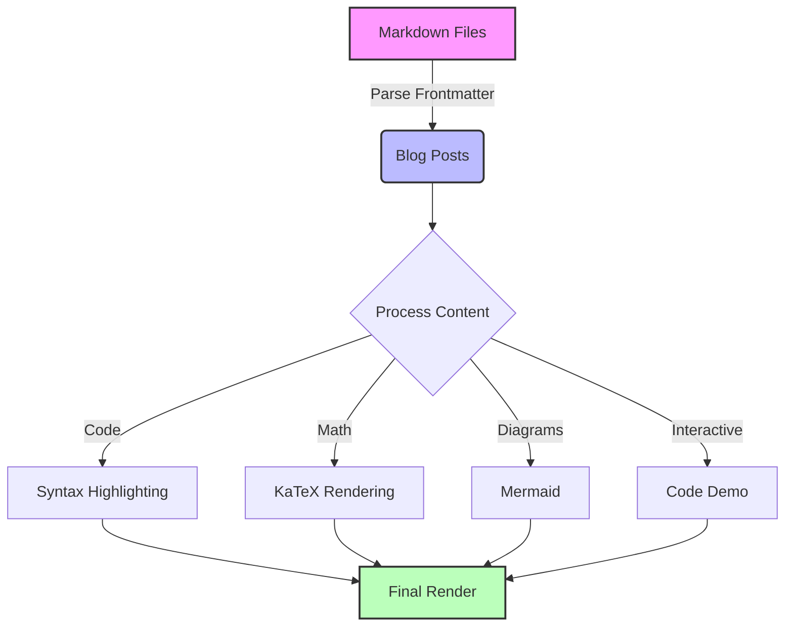

# Building a Modern Blog with React and Markdown

Let's explore how to build a modern blog system using React, TypeScript, and Markdown. Our implementation includes features like syntax highlighting, math equations, diagrams, and interactive code demos.

## Architecture Overview

Here's how our blog system works:



## Key Features

### 1. Interactive Code Examples

Try editing this code:

<CodeDemo title="Button Component">
```jsx
function Button({ children, onClick }) {
  return (
    <button 
      onClick={onClick}
      className="px-4 py-2 bg-blue-500 hover:bg-blue-600 text-white rounded-lg transition-colors"
    >
      {children}
    </button>
  );
}

// Example usage:
render(
  <Button onClick={() => alert('Clicked!')}>
    Click me!
  </Button>
);
```
</CodeDemo>

### 2. Math Equations

Our blog supports LaTeX math equations:

The quadratic formula: $x = \frac{-b \pm \sqrt{b^2 - 4ac}}{2a}$

And block equations:

$$
\begin{aligned}
\nabla \times \vec{\mathbf{B}} -\, \frac1c\, \frac{\partial\vec{\mathbf{E}}}{\partial t} & = \frac{4\pi}{c}\vec{\mathbf{j}} \\
\nabla \cdot \vec{\mathbf{E}} & = 4 \pi \rho \\
\nabla \times \vec{\mathbf{E}}\, +\, \frac1c\, \frac{\partial\vec{\mathbf{B}}}{\partial t} & = \vec{\mathbf{0}} \\
\nabla \cdot \vec{\mathbf{B}} & = 0
\end{aligned}
$$

### 3. Custom Components

Use alert components to highlight important information:

<Alert type="info">
This is an informational message about the blog system.
</Alert>

<Alert type="warning">
Make sure to follow the proper markdown format in your blog posts.
</Alert>

<Alert type="error">
Invalid frontmatter format can cause build failures.
</Alert>

### 4. Code Syntax Highlighting

```typescript
interface BlogPost {
  slug: string;
  frontmatter: {
    title: string;
    subtitle?: string;
    date: string;
    tags?: string[];
  };
  content: string;
}

function formatDate(date: string): string {
  return new Date(date).toLocaleDateString('en-US', {
    year: 'numeric',
    month: 'long',
    day: 'numeric'
  });
}
```

## Implementation Details

### Blog Post Structure

Our blog posts are stored as Markdown files with YAML frontmatter:

```markdown
---
title: "Post Title"
subtitle: "Optional subtitle"
date: "2025-05-02"
tags: ["tag1", "tag2"]
---

Content goes here...
```

### Image Optimization

Images in blog posts are automatically:
1. Converted to WebP format
2. Resized for optimal delivery
3. Generated with thumbnails for previews
4. Lazy loaded for better performance

### Performance Optimizations

1. Code splitting for markdown parsing
2. Lazy loading of heavy components
3. Image optimization pipeline
4. Efficient syntax highlighting

## Writing Guidelines

<Alert type="info">
Follow these guidelines for consistent blog posts:
</Alert>

1. Use clear, descriptive titles
2. Include a relevant subtitle
3. Tag your posts appropriately
4. Structure content with headings
5. Use code blocks with language hints
6. Include diagrams for complex topics

## Conclusion

This blog system provides a rich authoring experience while maintaining good performance through:

- Efficient markdown processing
- Optimized image delivery
- Interactive code examples
- Math equation support
- Custom components
- Responsive design

Feel free to use this post as a reference for the features available in your blog posts!