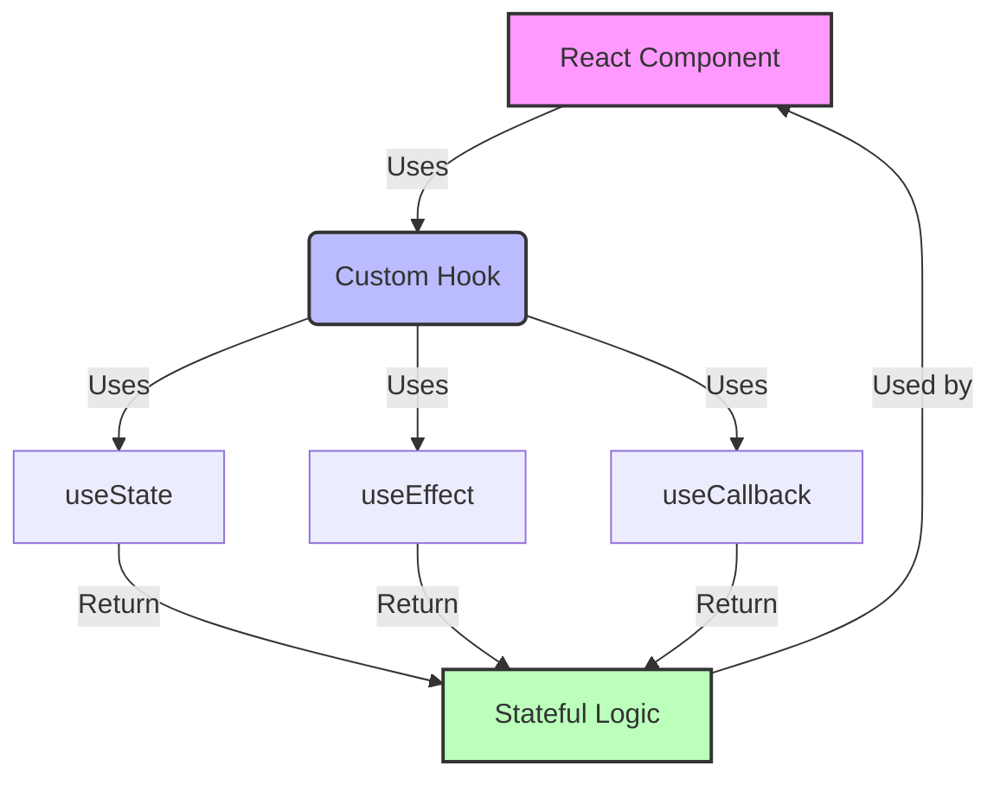

# Building Custom React Hooks for State Management

Custom hooks are one of React's most powerful features for reusing stateful logic between components. Let's explore how to build some useful custom hooks.

## Understanding Custom Hooks

Here's how custom hooks fit into React's component hierarchy:



## Example: useLocalStorage Hook

Let's create a hook that syncs state with localStorage:

<CodeDemo title="useLocalStorage Hook">
```typescript
function useLocalStorage<T>(key: string, initialValue: T) {
  // State to store our value
  // Pass initial state function to useState so logic is only executed once
  const [storedValue, setStoredValue] = useState<T>(() => {
    try {
      const item = window.localStorage.getItem(key);
      return item ? JSON.parse(item) : initialValue;
    } catch (error) {
      console.error(error);
      return initialValue;
    }
  });

  // Return a wrapped version of useState's setter function that ...
  // ... persists the new value to localStorage.
  const setValue = useCallback((value: T | ((val: T) => T)) => {
    try {
      // Allow value to be a function so we have same API as useState
      const valueToStore = value instanceof Function 
        ? value(storedValue)
        : value;
      
      setStoredValue(valueToStore);
      window.localStorage.setItem(key, JSON.stringify(valueToStore));
    } catch (error) {
      console.error(error);
    }
  }, [key, storedValue]);

  return [storedValue, setValue] as const;
}

// Example usage:
function DemoComponent() {
  const [name, setName] = useLocalStorage('name', 'Bob');
  
  return (
    <input
      value={name}
      onChange={e => setName(e.target.value)}
      placeholder="Enter your name"
    />
  );
}
```
</CodeDemo>

<Alert type="info">
The `as const` assertion ensures TypeScript correctly infers the tuple type, similar to useState's return type.
</Alert>

## Example: useDebounce Hook

Here's a hook that debounces a value:

<CodeDemo title="useDebounce Hook">
```typescript
function useDebounce<T>(value: T, delay: number = 500): T {
  const [debouncedValue, setDebouncedValue] = useState(value);

  useEffect(() => {
    const timer = setTimeout(() => {
      setDebouncedValue(value);
    }, delay);

    return () => {
      clearTimeout(timer);
    };
  }, [value, delay]);

  return debouncedValue;
}

// Example usage:
function SearchComponent() {
  const [search, setSearch] = useState('');
  const debouncedSearch = useDebounce(search);

  useEffect(() => {
    // API call here will only happen after user stops typing
    console.log('Searching for:', debouncedSearch);
  }, [debouncedSearch]);

  return (
    <input
      value={search}
      onChange={e => setSearch(e.target.value)}
      placeholder="Search..."
    />
  );
}
```
</CodeDemo>

## Example: useFetch Hook

A custom hook for handling API requests:

```typescript
interface UseFetchResult<T> {
  data: T | null;
  error: Error | null;
  loading: boolean;
}

function useFetch<T>(url: string): UseFetchResult<T> {
  const [data, setData] = useState<T | null>(null);
  const [error, setError] = useState<Error | null>(null);
  const [loading, setLoading] = useState(true);

  useEffect(() => {
    const abortController = new AbortController();

    const fetchData = async () => {
      try {
        const response = await fetch(url, {
          signal: abortController.signal
        });
        
        if (!response.ok) {
          throw new Error(`HTTP error! status: ${response.status}`);
        }
        
        const result = await response.json();
        setData(result);
        setError(null);
      } catch (e) {
        if (e.name === 'AbortError') return;
        setError(e instanceof Error ? e : new Error(String(e)));
        setData(null);
      } finally {
        setLoading(false);
      }
    };

    fetchData();

    return () => {
      abortController.abort();
    };
  }, [url]);

  return { data, error, loading };
}
```

<Alert type="warning">
Remember to handle cleanup in useEffect to prevent memory leaks and race conditions.
</Alert>

## Best Practices for Custom Hooks

1. **Naming Convention**: Always start custom hook names with "use"
2. **Single Responsibility**: Each hook should do one thing well
3. **Composition**: Build complex hooks by composing simpler ones
4. **TypeScript**: Use generics to make hooks type-safe and reusable
5. **Error Handling**: Always handle errors gracefully
6. **Cleanup**: Don't forget cleanup functions in useEffect

## Testing Custom Hooks

Here's how to test custom hooks using React Testing Library:

```typescript
import { renderHook, act } from '@testing-library/react-hooks';

describe('useLocalStorage', () => {
  beforeEach(() => {
    window.localStorage.clear();
  });

  it('should store and retrieve values', () => {
    const { result } = renderHook(() => 
      useLocalStorage('test-key', 'initial')
    );

    expect(result.current[0]).toBe('initial');

    act(() => {
      result.current[1]('updated');
    });

    expect(result.current[0]).toBe('updated');
    expect(localStorage.getItem('test-key')).toBe('"updated"');
  });
});
```

## Common Pitfalls

<Alert type="error">
Avoid these common mistakes when creating custom hooks:
</Alert>

1. Not handling the cleanup phase
2. Forgetting dependency arrays in useEffect
3. Mutating state directly instead of using setters
4. Not considering SSR compatibility
5. Breaking the rules of hooks

## Conclusion

Custom hooks are a powerful way to:
- Share logic between components
- Keep components clean and focused
- Make code more maintainable
- Enable easy testing of complex logic

Remember that custom hooks are just functions that use other hooks. They can be as simple or complex as needed, but should always follow React's rules of hooks.